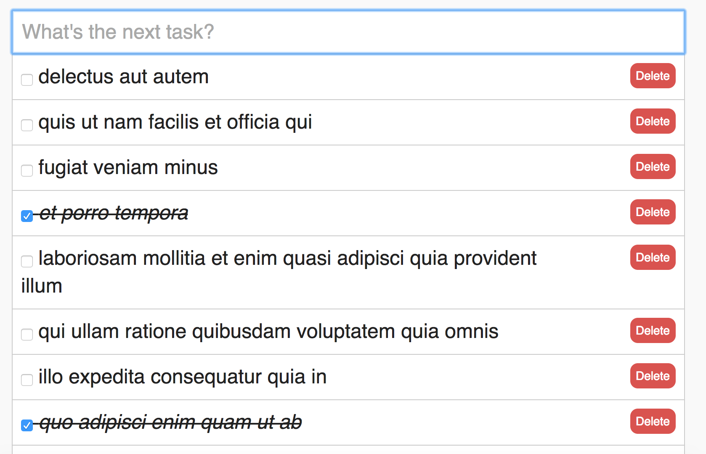

# Backbone TODO list

This application is connected to this API: `http://jsonplaceholder.typicode.com/todos`

It car add elements to the list, remove, mark the task as done.
Also, it renders with Mustache the templates.

Just open `index.html` in your browser.

